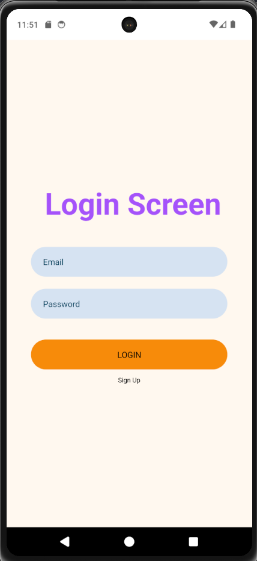
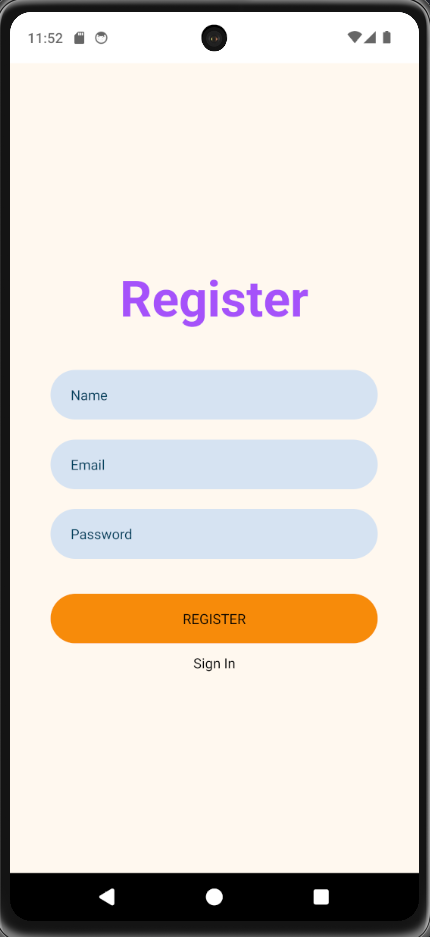
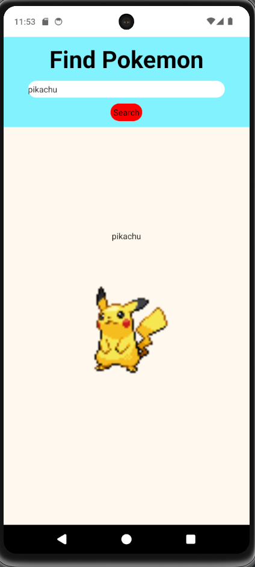

# mas-first-program
Keefe Oentoro
https://github.com/Kulkoen/mas-first-program

## Description
The app simply makes you log in and lets you search up Pokemon using their names. If the name is valid, it will display the name and a pokemon sprite.

Login Page


Sign Up Page


Pokemon Search



## References
- [Login Register Authentication in React Native with Node JS, Express JS and Mongo DB || #mernstack (youtube.com)](https://www.youtube.com/watch?v=p-YhMj1XHzs)
  - Used to learn how to connect MonogDB to React Native and create a basic server
- [Basic Login Screen with React-Native | by Ali Talha Çoban | Medium](https://alitalhacoban.medium.com/basic-login-screen-with-react-native-c9f7fdcc8dae)
  - Used to make a simple login screen
- https://www.youtube.com/watch?v=Uj2Iq8TCQVE
    - Used to learn how to upload the Express server 
- PokéAPI (pokeapi.co)
  - Documentation used to display Pokemon on screen
- https://expressjs.com/en/guide/routing.html
  - Used to learn how to navigate pages/screens
- cylic.sh
  - Used to host the backend
  - https://sore-gold-termite-tam.cyclic.app
    - The URL used for API calls

## Installation
In order to run the app:
- Navigate to frontend folder
- Install all dependencies using ```npm install``` in the terminal
- Run ```npm start```
- Either use a personal smartphone to scan the QR code and run from your smartphone in the Expo Go app
- or run an emulator

## Partner Work
My partner and I simply did UI changes as we built different applications on with different stacks. As such, it was difficult to make too many changes. Next time, it would probably be better to work with more similar tech stacks.
